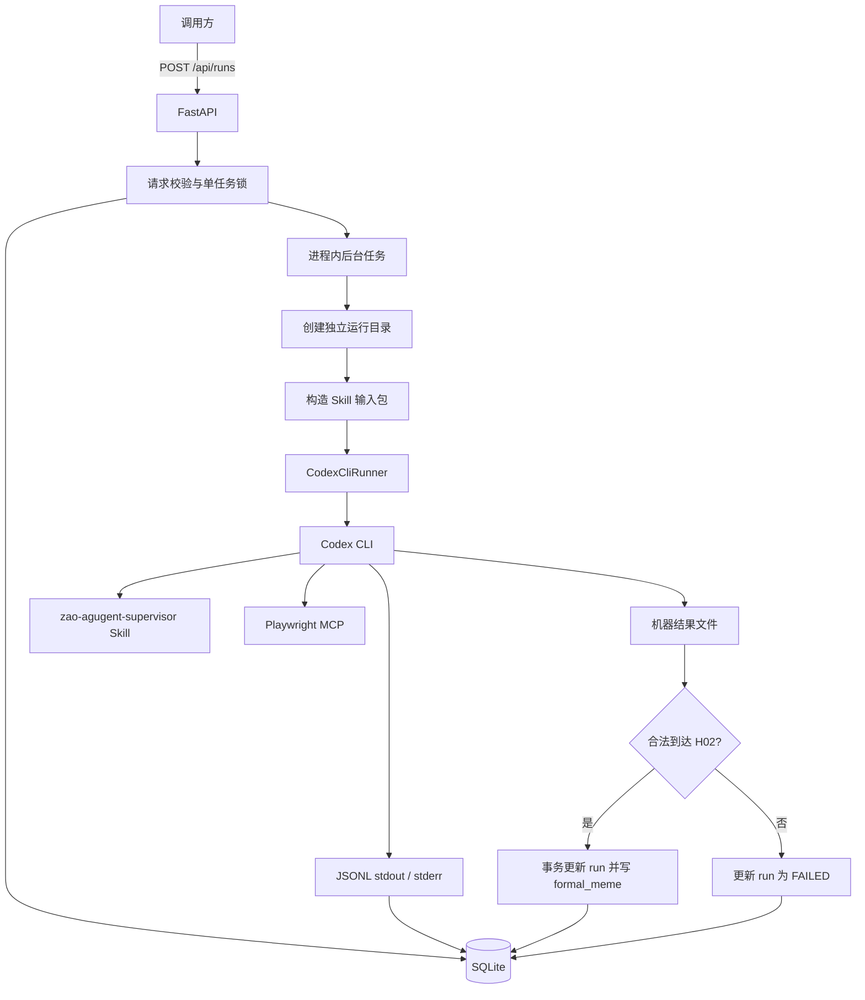
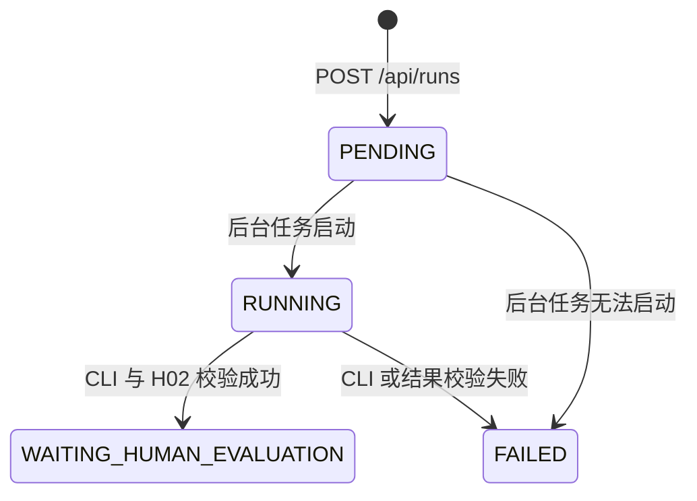

# 凿agugent Skill Runner API 设计

## 1. 背景与目标

当前 `zao-agugent-supervisor` Skill 已能通过 Codex CLI 与 Playwright MCP 完成人工种子和自主搜索两种真实轮次，并在形成最终草稿后停在 `H02 / WAITING_HUMAN_EVALUATION`。

本设计把这项能力封装为一个本地 HTTP 服务。首版只提供一个启动接口，不重新实现 Skill 内部的状态机，也不复用现有重型工作流后端。

目标：

- 通过统一接口启动 `MANUAL_SEED` 或 `AUTO`；
- 每轮使用新的临时目录和新的 Codex CLI 对话；
- 使用 Playwright MCP 完成真实网页搜索；
- 将运行状态、CLI 日志、Token、最终机器结果存入本地 SQLite；
- 合法到达 H02 后立即将结果写入正式梗库；
- AUTO 从人工评价合格的正式梗中随机抽取动态示例；
- 为未来增加 Claude Code Runner 留下一个最小替换边界，但不提前实现插件系统。

## 2. 非目标

首版不实现：

- 前端页面；
- 运行查询、日志查询、评价提交或正式梗查询接口；
- 多任务并发、任务队列、Redis、Celery；
- 暂停、取消、重试、崩溃恢复或临时目录清理；
- Claude Code、Exa 或其他 Agent、搜索执行器；
- 在服务端重新编排 O/V/T/G/H 节点；
- 自动计算人工评价合格线；
- 对现有重型后端进行兼容或迁移。

## 3. 总体架构



服务端只负责进程生命周期、输入组装、日志落库和结果校验。Skill 继续作为唯一业务工作流定义。

## 4. 技术栈与目录边界

- Python 3.12；
- FastAPI；
- Pydantic；
- SQLAlchemy 2 Async；
- SQLite + aiosqlite；
- pytest；
- Codex CLI；
- Playwright MCP。

建议在当前仓库新增独立目录：

```text
skill_runner/
  app/
    main.py
    config.py
    api.py
    database.py
    models.py
    schemas.py
    run_service.py
    prompt_builder.py
    result_parser.py
    runners/
      base.py
      codex_cli.py
  tests/
  pyproject.toml
  README.md
```

该目录不依赖现有 `backend/app/workflow`、节点 Registry 或 Provider 实现。

## 5. 唯一 HTTP 接口

### 5.1 启动任务

```http
POST /api/runs
Content-Type: application/json
```

人工种子请求：

```json
{
  "mode": "MANUAL_SEED",
  "seed_text": "我怀疑你在开车，但我没有证据"
}
```

自主搜索请求：

```json
{
  "mode": "AUTO"
}
```

成功响应：

```http
202 Accepted
```

```json
{
  "run_id": "7f25a7a4-4f81-47ca-8954-cf5e62244fc7",
  "status": "PENDING"
}
```

### 5.2 请求校验

- `mode` 只允许 `MANUAL_SEED` 和 `AUTO`；
- `MANUAL_SEED` 必须提供去除首尾空白后非空的 `seed_text`；
- `AUTO` 禁止提供 `seed_text`；
- 服务进程内已有 `PENDING` 或 `RUNNING` 任务时返回 `409 ACTIVE_RUN_EXISTS`；
- 请求字段使用 `extra=forbid`，拒绝未声明字段。

### 5.3 错误响应

```json
{
  "error": {
    "code": "ACTIVE_RUN_EXISTS",
    "message": "another run is active"
  }
}
```

首版不提供任何其他 HTTP 路由。状态、日志和正式梗通过 SQLite 查看。

## 6. 运行状态



状态含义：

- `PENDING`：数据库已创建任务，后台执行尚未开始；
- `RUNNING`：Codex CLI 子进程已启动；
- `WAITING_HUMAN_EVALUATION`：合法到达 H02，正式梗已入库；
- `FAILED`：没有形成可入库正式梗。

Skill 合法地因证据不足停止，也映射为 `FAILED`，但必须保存原始停止状态与业务原因，不能伪装成 CLI 异常。

## 7. Agent Runner

### 7.1 最小接口

```python
class AgentRunner(Protocol):
    async def run(self, request: RunRequest, workdir: Path) -> RunnerResult: ...
```

首版只有 `CodexCliRunner`。接口的目的仅是隔离子进程实现，未来增加 Claude Code 时无需改动 API 和数据库；首版不设计 Runner 注册中心、插件发现或动态配置系统。

### 7.2 Codex CLI 命令

```bash
codex exec \
  --ephemeral \
  --disable memories \
  --approve-for-me \
  --json \
  -C <run_dir> \
  -c 'mcp_servers.playwright.command="npx"' \
  -c 'mcp_servers.playwright.args=["-y","@playwright/mcp@latest","--isolated"]' \
  -c 'mcp_servers.playwright.default_tools_approval_mode="approve"'
```

Prompt 通过子进程标准输入传入，不把种子文本拼接进 shell 命令。子进程使用参数数组启动，不通过 `shell=True`。

CLI 使用当前设备已有的 Codex 登录和模型配置。首版不通过 API 管理密钥、模型或 Codex 配置。

### 7.3 新对话与隔离

每轮：

1. 创建 `RUN_ROOT/{run_id}`；
2. 复制 `SKILL_PATH` 到运行目录的 `.agents/skills/zao-agugent-supervisor`；
3. 初始化最小 Git 仓库；
4. 写入本轮 `prompt.md`；
5. 使用 `--ephemeral` 启动新的 Codex 对话；
6. 使用 `--disable memories` 禁止用户级记忆注入；
7. Prompt 明确禁止读取原工作区和用户记忆；CLI 仍可加载运行所需的系统 Skill、模型认证与 MCP 配置，不把这种配置加载误报为项目上下文。

临时目录在任务结束后保留，不自动删除。

## 8. Prompt 构造

### 8.1 MANUAL_SEED

输入包至少包含：

- `mode: MANUAL_SEED`；
- `source_scope: COMPLETE_MEME_UNIT`；
- 请求中的 `seed_text`；
- `continuous_execution: false`；
- Playwright MCP 搜索约束；
- 固定输出文件约定。

人工种子仍只是待核验线索，不能绕过 Skill 的完整边界与来源证据门禁。

### 8.2 AUTO

输入包至少包含：

- `mode: AUTO`；
- `source_scope: COMPLETE_MEME_UNIT`；
- `adaptation_mode: AUTO_ROUTE`；
- 正式梗标题排除清单；
- 最多 `DYNAMIC_EXAMPLE_COUNT` 条动态示例；
- `continuous_execution: false`；
- Playwright MCP 搜索约束；
- 固定输出文件约定。

动态示例只从 `dynamic_example_eligible=true` 的正式梗随机抽取。每条包含：

- 原梗标题；
- 原梗全文；
- 正式梗标题；
- 正式梗全文。

Prompt 必须明确：动态示例只用于理解改编风格，不是本轮网络证据，不能计入原梗、变式、模板或传播度证明，也不能直接复用为本轮结果。

不足配置数量时全部使用；没有合格记录时只使用 Skill 内固定示例。Skill 内现有固定示例保持不变。

## 9. 输出约定与成功判定

Prompt 要求 Codex CLI 在运行目录写出：

```text
run-result.json
search-records.json
final.md
metrics.json
```

服务只以 `run-result.json` 作为业务成功判定主输入，其他文件用于排查。

成功必须同时满足：

1. Codex CLI 退出码为 0；
2. `run-result.json` 存在且是合法 JSON；
3. `final_state == WAITING_HUMAN_EVALUATION`；
4. `stop_node == H02`；
5. 完整原梗标题或可派生标题存在；
6. 完整原梗正文非空；
7. 最终正式梗标题或可派生标题存在；
8. 最终正式梗正文非空。

服务不重新评价模板、证据或文案质量，但会保存完整机器记录供人工复核。

## 10. SQLite 数据库

### 10.1 `runs`

| 字段 | 类型 | 约束/说明 |
|---|---|---|
| `id` | String(36) | 主键，UUID |
| `mode` | String(32) | 非空 |
| `seed_text` | Text | MANUAL_SEED 非空，AUTO 为空 |
| `status` | String(32) | 非空 |
| `workdir` | Text | 非空 |
| `started_at` | DateTime | 可空 |
| `finished_at` | DateTime | 可空 |
| `duration_seconds` | Integer | 可空，真实墙钟秒数 |
| `codex_exit_code` | Integer | 可空 |
| `input_tokens` | Integer | 默认 0 |
| `cached_input_tokens` | Integer | 默认 0 |
| `output_tokens` | Integer | 默认 0 |
| `reasoning_tokens` | Integer | 默认 0 |
| `error_code` | String(64) | 可空 |
| `error_message` | Text | 可空 |
| `skill_stop_reason` | Text | 可空，保存合法业务停止原因 |
| `result_json` | JSON | 可空，完整机器结果 |
| `formal_meme_id` | String(36) | 可空，成功后回填 |
| `created_at` | DateTime | 非空 |

### 10.2 `run_logs`

| 字段 | 类型 | 约束/说明 |
|---|---|---|
| `id` | Integer | 自增主键 |
| `run_id` | String(36) | 外键，索引 |
| `sequence` | Integer | 本轮内单调递增，`run_id + sequence` 唯一 |
| `stream` | String(16) | `STDOUT` / `STDERR` / `SYSTEM` |
| `event_type` | String(64) | 可空，Codex JSONL 类型 |
| `payload_json` | JSON | 可空，可解析事件 |
| `raw_text` | Text | 可空，非 JSON 原文 |
| `created_at` | DateTime | 非空 |

stdout 与 stderr 分别异步读取，统一通过进程内序号分配器写入顺序号。首版只保证数据库观察到的全局写入顺序，不声称恢复两个操作系统管道之间无法观测的绝对先后。

### 10.3 `formal_memes`

| 字段 | 类型 | 约束/说明 |
|---|---|---|
| `id` | String(36) | 主键，UUID |
| `source_run_id` | String(36) | 外键且唯一 |
| `original_title` | Text | 非空 |
| `original_text` | Text | 非空 |
| `final_title` | Text | 非空 |
| `final_text` | Text | 非空 |
| `evaluation_status` | String(32) | 初始 `PENDING` |
| `evaluation_json` | JSON | 初始为空，预留后续能力 |
| `dynamic_example_eligible` | Boolean | 初始 `false` |
| `created_at` | DateTime | 非空 |

首版没有评价接口，因此新记录不会自动进入动态示例池。未来人工评价能力负责写入 `evaluation_json`、更新 `evaluation_status`，并仅在评价合格时将 `dynamic_example_eligible` 更新为 `true`。

## 11. 事务和并发

### 11.1 单任务约束

服务使用一个进程内 `asyncio.Lock` 表示活动任务。创建任务时在同一临界区完成：

1. 检查锁；
2. 创建 `runs` 记录；
3. 注册后台任务；
4. 返回 `run_id`。

首版按单进程启动，不支持多个 Uvicorn worker。SQLite 中遗留的 `RUNNING` 记录不参与新进程锁判断；应用崩溃后的任务不恢复，遗留状态由人工查看和处理。

任务到达 `WAITING_HUMAN_EVALUATION` 或 `FAILED` 后释放锁。H02 是本次 API 调用的终点；即使尚未提交人工评价，调用方也可以主动发起下一次独立任务。未评价正式梗仍保持 `dynamic_example_eligible=false`，因此不会影响后续 AUTO 的动态示例。

### 11.2 H02 入库事务

成功时在一个数据库事务中：

1. 插入 `formal_memes`，`source_run_id` 唯一；
2. 更新 `runs.result_json`；
3. 更新 Token、耗时和退出码；
4. 回填 `runs.formal_meme_id`；
5. 将 `runs.status` 更新为 `WAITING_HUMAN_EVALUATION`。

任何一步失败则回滚，不允许出现 run 显示成功但没有正式梗，或正式梗存在但 run 未成功的半完成状态。

## 12. 日志处理

Codex CLI 使用 `--json`，stdout 的每一行按以下方式处理：

- 合法 JSON：保存完整 `payload_json`，同时提取顶层 `type` 到 `event_type`；
- 非 JSON：原样保存到 `raw_text`；
- stderr：原样保存，并在能够安全解析时附加事件类型；
- 服务自身的重要状态变化使用 `stream=SYSTEM`。

日志写入失败视为任务失败，因为首版没有其他 API 或日志通道可供排查。已经写入的旧日志不删除。

不得在额外日志中主动输出 API Key、Cookie 或本地认证内容；CLI 自身输出按原样保存，服务不解析或导出浏览器会话秘密。

## 13. 失败分类

| 错误码 | 含义 |
|---|---|
| `CLI_START_FAILED` | 无法启动 Codex CLI |
| `CLI_EXIT_NON_ZERO` | CLI 非零退出 |
| `OUTPUT_MISSING` | 缺少 `run-result.json` |
| `OUTPUT_INVALID` | JSON 或必要字段不合法 |
| `SKILL_STOPPED_WITHOUT_RESULT` | Skill 合法停止但未到 H02 |
| `LOG_PERSISTENCE_FAILED` | CLI 日志无法可靠落库 |
| `PERSISTENCE_FAILED` | 最终结果事务失败 |

所有失败均保留运行目录、已写入日志、退出码和可获得的 Skill 停止原因。

## 14. 配置

```env
DATABASE_URL=sqlite+aiosqlite:///./data/skill-runner.db
RUN_ROOT=./data/runs
SKILL_PATH=./.agents/skills/zao-agugent-supervisor
DYNAMIC_EXAMPLE_COUNT=3
CODEX_COMMAND=codex
```

启动时校验：

- SQLite 父目录可创建；
- `RUN_ROOT` 可创建和写入；
- `SKILL_PATH/SKILL.md` 存在；
- `CODEX_COMMAND` 可执行。

Playwright、浏览器和网络能力仍由 Skill 的 S00 实测，服务启动检查不冒充业务搜索可用性。

## 15. 测试方案

### 15.1 单元测试

- MANUAL_SEED 缺少或提供空种子时返回 422；
- AUTO 提供种子时返回 422；
- 未声明字段返回 422；
- Prompt 不把种子拼接进 shell 命令；
- AUTO 只抽取 `dynamic_example_eligible=true` 的记录；
- AUTO 最多抽取配置数量且不足时不补造示例；
- 动态示例被标记为风格参考而非证据；
- 结果解析器拒绝缺文件、非法 JSON、非 H02 和空文本；
- Token usage 从 `turn.completed` 事件正确汇总。

### 15.2 集成测试

使用 Fake Runner，不产生真实模型或搜索费用：

- `POST /api/runs` 返回 202 和 run_id；
- 后台状态从 PENDING 进入 RUNNING；
- 活动任务存在时第二个请求返回 409；
- stdout、stderr 和 SYSTEM 日志按序落库；
- 合法 H02 结果在单事务中写入正式梗并更新 run；
- 任一失败路径不写正式梗；
- `source_run_id` 唯一约束阻止重复入库；
- 运行结束后锁释放，可以启动下一轮。

### 15.3 手工真实测试

真实测试不进入默认测试套件，避免自动产生费用：

1. 启动服务；
2. 调用一轮 MANUAL_SEED；
3. 直接查询 SQLite，确认日志、Token、机器结果和正式梗；
4. 调用一轮 AUTO；
5. 确认使用新的运行目录和新对话；
6. 确认未评价记录不会进入动态示例；
7. 人工将一条记录标为评价合格并启用动态示例；
8. 再运行 AUTO，确认 Prompt 实际注入该示例；
9. 确认两轮均在 H02 停止。

## 16. 验收标准

1. 服务从源码可启动，只依赖本地 SQLite，不需要 Redis、Docker 或外部任务队列。
2. 对外只有 `POST /api/runs` 一个接口。
3. 同一接口支持 MANUAL_SEED 和 AUTO，并执行严格参数校验。
4. 调用后立即返回 run_id，CLI 在后台执行。
5. 同时最多运行一个任务。
6. 每轮创建新的目录和 Codex CLI 对话，并禁用用户记忆。
7. 首版只使用 Codex CLI + Playwright MCP。
8. 所有 CLI stdout、stderr 和服务状态日志都进入 SQLite。
9. H02 合法结果和正式梗在一个事务中落库。
10. 未到 H02 的任务不得写入正式梗库。
11. 入库正式梗初始不可用作动态示例。
12. AUTO 只随机使用人工评价合格且已启用的动态示例。
13. 动态示例不能被当作本轮网络证据。
14. 临时运行目录默认保留。
15. 默认自动测试不调用真实 Codex、模型或搜索服务。

## 17. 后续扩展边界

只有出现真实需求时再扩展：

- 新增 Claude Code Runner：实现同一 `AgentRunner` 接口；
- 新增搜索方式：优先通过对应 Runner 输入配置或 Skill 适配器实现；
- 新增人工评价 API：更新正式梗评价与动态示例资格；
- 新增状态与日志查询 API：读取现有 SQLite 数据；
- 新增并发或队列：替换进程内锁，但不改变请求和结果契约。

这些能力不属于首版，不应提前引入抽象层或数据库表。
