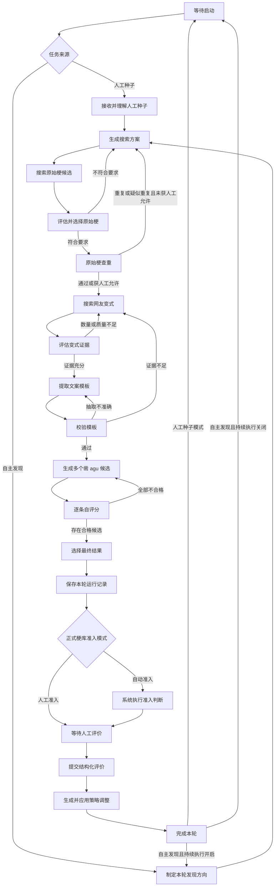

# “凿 agugent”产品需求文档

- 文档状态：需求确认稿
- 产品阶段：MVP／冷启动阶段
- 适用范围：单用户 Web 应用
- 更新日期：2026-08-26

## 1. 目录

1. 目录
2. 一句话主张
3. 需求描述
   1. 需求概述
   2. 用户故事
   3. 功能流程图
   4. 功能详述
   5. 交互设计
4. 需求边界
5. 验收标准

## 2. 一句话主张

“凿 agugent”是一个能够从公开搜索结果中发现中文文案模板梗、提取模板、生成并选出最佳“凿 agu”改写，并通过逐轮结构化人工评价持续调整下一轮策略的 Agent。

## 3. 需求描述

### 3.1 需求概述

#### 3.1.1 背景

网络上存在大量具有固定句式和可替换槽位的中文“模板梗”。网友会围绕同一个基础表达替换人物、行为或对象，形成具有共同结构的多个变式。例如：

- “你说得对，但是《……》是一款……”
- “我是来……的，你们要干什么”
- “……，真可怜，又被他们……了吧，你应该清楚，只有我才是你的朋友……”

本产品希望将这些模板梗中的表达对象、动作和上下文自然改写为以“agu”和“凿”为核心的文案。这里不是机械地把主语替换成“agu”、把谓语替换成“凿”，而是以保留原梗辨识度为前提，根据中文语义、语序和语气做自然调整。

#### 3.1.2 产品目标

产品需要完成以下闭环：

1. 根据人工种子或自主发现方向搜索原始模板梗。
2. 评估原始梗是否具有模板价值和可见传播证据。
3. 搜索该原始梗的多个网友变式。
4. 根据变式提取并校验可复用文案模板。
5. 将“agu／凿 agu”自然回填到模板中，生成多条候选。
6. 对候选自评分、排序并选出一条最终结果。
7. 由人工分别评价处理链、候选集和最终结果。
8. 根据本轮结构化人工评价调整策略，并立即应用于下一轮。

#### 3.1.3 MVP 核心原则

- **流程显式：** 使用可观察的状态机工作流，每一步都有明确状态和流转条件。
- **过程可读：** 每一步输出人可读的输入、目标、判断、结果、证据和下一步。
- **证据可追溯：** 搜索所得原始梗和网友变式均保留公开来源信息。
- **评价分层：** 人工分别评价处理链、候选和最终结果，避免只得到笼统总分。
- **逐轮反馈：** 冷启动阶段严格执行“一轮生成—一次评价—一次策略更新—下一轮生成”。
- **历史不覆盖：** 重试、回退和人工修正产生新分支，旧输出继续保留。
- **运行与成果分离：** 运行记录库与正式梗库分开管理。

#### 3.1.4 核心概念

- **原始梗：** 被识别为具有可复用句式或表达结构的基础文案梗。
- **网友变式：** 公开网页中围绕同一原始梗进行替换或改写的实际文案。
- **文案模板：** 根据原始梗和多个变式归纳出的固定部分、可替换槽位及槽位语义。
- **候选：** Agent 根据模板生成的不同“凿 agu”文案。
- **最终结果：** Agent 在候选集中自评后选出的最佳文案。
- **一轮任务：** 从人工种子或自主发现开始，至人工评价和策略更新完成为止的完整处理过程。
- **策略：** 各处理阶段在下一轮采用的搜索、判断、抽取、生成或选优规则。PRD 仅规定策略行为，不规定技术表达方式。

### 3.2 用户故事

#### 3.2.1 人工种子冷启动

作为使用者，我希望输入一个已知梗、关键词或文案线索，让 Agent 完成搜索、变式收集、模板抽取和“凿 agu”生成，以便快速积累基础策略。

#### 3.2.2 自主发现

作为使用者，我希望随时停止提供人工种子并切换到自主发现模式，让 Agent 自己寻找尚未处理过的原始梗，以便持续扩展内容来源。

#### 3.2.3 观察处理过程

作为开发调试者，我希望查看每个状态的输入、判断理由、来源证据、自评分、输出和回退过程，以便定位搜索、抽取或生成的问题。

#### 3.2.4 评价处理链

作为评审者，我希望分别评价原始梗选择、变式证据和模板抽取等环节，以便反馈能准确作用到发生问题的阶段。

#### 3.2.5 比较候选与最终结果

作为评审者，我希望同时看到 Agent 生成的多条候选、逐条自评分和最终选择理由，以便判断候选质量以及 Agent 是否选对了最佳结果。

#### 3.2.6 人工干预

作为使用者，我希望暂停、重试、回退、改选或修正某一步的结果，并从该节点继续执行，以便在 Agent 判断错误时及时纠正，而不必完全重启任务。

#### 3.2.7 控制正式入库

作为内容管理者，我希望选择由人工或系统决定是否将成果放入正式梗库，并能够下架或恢复正式成果，以便将实验过程与可用内容分开管理。

#### 3.2.8 查看反馈效果

作为评审者，我希望评价后看到本轮反馈影响了哪些阶段、调整了什么以及下一轮将验证什么，以便确认 Agent 的“学习”是具体且可追踪的。

#### 3.2.9 控制连续运行

作为使用者，我希望在自主发现模式下选择是否持续执行：开启后在每轮人工评价和策略更新完成后自动启动下一轮，关闭后回到等待启动状态。

### 3.3 功能流程图

#### 3.3.1 串行约束

冷启动阶段每轮严格串行：

`本轮生成完成 → 人工完成评价 → Agent 更新策略 → 本轮完成 → 才能开始下一轮`

人工评价不一定阻塞正式入库，但必须阻塞本轮完成和下一轮生成。无论是否开启持续执行，都不能跳过人工评价连续生成多轮。

#### 3.3.2 人工干预支线

执行期间，人工可以暂停、终止、重试或修正节点结果。重试或修正会从指定节点创建新分支；旧分支保留，新分支可被设为当前有效链路。终止任务不进入评价和策略更新阶段，也不触发下一轮。

### 3.4 功能详述

#### 3.4.1 运行配置与启动

系统支持两种任务来源：

1. **人工种子模式：** 人工输入已知梗、关键词或原始文案线索。Agent 先说明对种子的理解，再生成搜索方案。
2. **自主发现模式：** Agent 自行确定本轮探索方向，并寻找未被处理过的原始梗。

用户可以切换任务来源。切换只影响下一轮，不改变正在执行或等待评价的任务。

系统支持两种正式梗库准入模式：

1. **人工准入：** 人工评价时必须决定“入库”或“不入库”。
2. **自动准入：** 系统给出准入结论及人可读理由，人工评价不阻塞该准入动作，但人工可以在评价时推翻结论。

自主发现模式提供“持续执行”开关：

- 开启：评价提交且策略更新完成后，自动启动下一轮。
- 关闭：本轮结束后回到等待启动状态。
- 该开关在人工种子模式下不生效。

#### 3.4.2 状态及预期输出

| 状态 | 功能说明 | 预期的人可读输出 |
|---|---|---|
| 等待启动 | 等待人工配置并发起任务 | 当前任务模式、持续执行状态、准入模式、当前策略版本、可执行操作 |
| 接收并理解人工种子 | 解释人工提供的梗或线索 | 原始输入、核心表达、Agent 的理解、可能的歧义 |
| 制定发现方向 | 自主决定本轮探索范围 | 计划探索的梗类型、选择原因、与历史方向的差异 |
| 生成搜索方案 | 制定原始梗搜索计划 | 搜索关键词及组合、各组关键词的目的、搜索顺序、依据的策略规则 |
| 搜索原始梗候选 | 获取可能具有模板价值的文案 | 候选文案、来源标题、来源链接、摘要、发现关键词、基本证据 |
| 评估并选择原始梗 | 判断候选是否适合作为模板梗 | 每个候选的结构化自评分、淘汰原因、选中结果及理由 |
| 原始梗查重 | 判断是否已处理过相同或相似原始梗 | 疑似重复项、相似依据、查重结论、是否获得人工允许 |
| 搜索网友变式 | 查找同一原始梗的公开文案变式 | 每条变式文案、来源、搜索关键词、与原始梗的关系说明 |
| 评估变式证据 | 排除无关或不足以支撑模板的内容 | 有效与无效变式分类、排除原因、证据覆盖情况、是否足以抽取模板 |
| 提取文案模板 | 归纳可复用的表达结构 | 固定部分、可替换槽位、槽位语义、从各变式归纳模板的依据 |
| 校验模板 | 验证模板能否解释已有变式 | 变式回填或匹配结果、偏差说明、模板是否通过 |
| 生成候选 | 形成多条“凿 agu”文案 | 候选文案、各自回填思路、为保证通顺所做的语序或措辞调整 |
| 逐条自评分 | 从多个维度评价候选 | 每条候选的分项评分、优点、问题和是否合格 |
| 选择最终结果 | 从合格候选中选择最佳项 | 最终结果、候选排序、选择理由、未选择其他候选的原因 |
| 保存本轮运行记录 | 固化本轮过程与当前有效分支 | 本轮编号、保存结果、当前有效分支、完整性状态 |
| 正式梗库准入 | 决定是否进入正式梗库 | 准入模式、准入结论、理由或待人工选择项 |
| 等待人工评价 | 收集本轮结构化人工反馈 | 三层评价表、必评项完成情况、干预与分支摘要 |
| 生成并应用策略调整 | 将反馈转化为下一轮策略变化 | 反馈摘要、受影响阶段、调整前后差异、新策略版本、下一轮验证重点 |
| 完成本轮 | 结束本轮并决定后续动作 | 最终状态、是否入库、下一步行为、下一轮策略版本 |
| 暂停／异常待处理 | 等待人工恢复或处理问题 | 所在节点、已完成内容、暂停或失败原因、可用的继续操作 |

所有执行状态还必须共同展示：

- 当前正在做什么以及为什么这样做。
- 使用了哪些输入、来源和策略版本。
- 得到了什么结果。
- 自评是否通过以及理由。
- 下一步将进入哪个状态。
- 是否发生重试、回退或人工修正。

#### 3.4.3 原始梗选择与查重

原始梗选择需要综合判断：

- 是否为中文纯文本文案。
- 是否具有可辨识的共同句式或表达结构。
- 是否存在公开可见的传播或改编证据。
- 是否适合提取为可替换模板。
- 是否有可能自然融入“agu／凿 agu”。

“传播度”仅表示基于当前可见搜索结果作出的相对评估，不代表全网真实传播量。

自主发现模式必须查重：

- 查重范围至少覆盖正式梗库和运行记录库。
- 重复或疑似重复时，默认回到搜索阶段重新发现。
- 人工可以明确允许重新处理疑似重复项，并填写原因。

人工种子模式同样展示查重结果，但发现重复时允许人工决定是否继续，以满足复测或重新生成需求。

MVP 只定义查重行为和人工兜底，不规定具体算法、阈值或数据字段。

#### 3.4.4 变式搜索、模板提取与校验

Agent 根据选中的原始梗生成变式搜索词，查找多个网友实际改编文案，并区分：

- 能够证明共同模板结构的有效变式。
- 只重复原文、没有形成改编的内容。
- 与目标梗无关或误匹配的内容。
- 来源或文本证据不足的内容。

只有证据足以支撑共同结构时才能提取模板。模板至少描述固定文本、可替换槽位和槽位语义，并说明归纳依据。

模板必须用已收集的有效变式进行校验。若无法解释主要变式，应重新提取；若问题来自证据不足，应继续搜索变式。未经充分证据支持的归纳不得标记为已验证模板。

#### 3.4.5 候选生成、自评分与选优

Agent 根据已验证模板生成多条具有实际差异的“凿 agu”候选。生成不采用机械的词性替换，而以以下目标为准：

- 保留原梗的核心句式、语气或辨识点。
- “agu”和“凿”在语义、语序和上下文中自然成立。
- 必要时可以调整词形、语序、指代和连接表达。
- 候选之间体现不同但合理的改写思路，不用近义词替换伪造多样性。

Agent 对每条候选进行结构化自评分，至少覆盖通顺度、原梗辨识度、“agu／凿”融合自然度、好笑程度和模板逻辑一致性。

Agent 对候选排序并选择一条最终结果，说明选择理由和其他候选未被选择的原因。如果全部候选均未达到自身合格标准，应返回候选生成阶段，不得强行选择。

#### 3.4.6 人工评价

每轮必须完成三层结构化评价。

**处理链评价：**

- 原始梗传播度。
- 原始梗适用性。
- 搜索结果相关性。
- 变式证据质量。
- 模板提取准确度。
- 处理链整体合理性。

**候选集整体评价：**

- 候选之间是否具有有效差异。
- 是否覆盖不同的自然改写思路。
- 整体质量是否达到可选择水平。

**单条候选评价：**

- 语句通顺度。
- 原梗辨识度。
- “agu／凿”融合自然度。
- 好笑程度。
- 是否符合原模板表达逻辑。
- 可用／修改后可用／不可用。
- 可选修改建议。

**最终结果评价：**

- 是否为候选中的最佳项。
- 通顺度。
- 原梗辨识度。
- “凿 agu”契合度。
- 好笑程度。
- 整体满意度。
- 若不是最佳项，选择更合适的候选或说明全部不合适。

人工还必须定位主要问题，可多选：搜索方案、原始梗选择、原始梗查重、变式搜索、变式筛选、模板提取、模板校验、候选生成、候选自评分、最终结果选择或本轮无明显问题。

所有评分使用 1～5 分，含义如下：

| 分数 | 通用含义 |
|---|---|
| 1 | 明显不符合要求，无法使用 |
| 2 | 问题较多，需要大幅调整 |
| 3 | 基本符合，但存在明显改进空间 |
| 4 | 整体较好，只有少量问题 |
| 5 | 完全符合本轮预期 |

自由文本意见默认可选。以下情况必须补充原因：

- 任一评价项为 1 分。
- 判断最终结果不是最佳候选，但未选择替代候选。
- 推翻自动准入结论。
- 终止任务。
- 允许重新处理疑似重复的原始梗。

#### 3.4.7 逐轮策略反馈

评价提交后，Agent 必须完成策略反馈，才能结束本轮。反馈结果包括：

- 人工评分和文字反馈摘要。
- Agent 自评分与人工评分之间的差异。
- 被判定存在问题的阶段。
- 下一轮应保持的有效做法。
- 下一轮需要改变的策略。
- 每项调整对应的人工反馈依据。
- 调整前后的策略差异。
- 新策略版本。
- 下一轮需要重点验证的假设。

策略反馈遵循以下规则：

- 只影响下一轮及后续任务，不改写历史记录。
- 每次调整必须人可读、可追溯、可回退。
- 不允许只输出“已学习”而不说明具体改变。
- 负面评价优先影响对应阶段，不无依据地改变其他阶段。
- 人工改选候选时，优先反馈至候选选优策略，不自动判定候选生成策略存在问题。
- 人工修改模板时，可以同时影响模板提取与模板校验策略，但必须分别说明依据。
- 下一轮必须显示其采用的新策略版本。
- 策略更新失败时，本轮停留在异常状态，不得开始下一轮。

冷启动阶段只要求本轮评价直接影响下一轮，不在 MVP 中评价长期学习效果。

#### 3.4.8 人工干预与历史分支

执行过程中，人工可以：

- 暂停或继续当前任务。
- 终止当前任务。
- 重试当前节点。
- 回到指定节点重新执行。
- 排除 Agent 选中的结果。
- 从已有结果中人工改选。
- 修正模板、候选或最终结果。
- 补充搜索关键词或变式证据。

人工干预规则：

- 干预只改变当前轮的当前分支及其后续节点，不覆盖历史输出。
- 从指定节点重新执行时创建新分支。
- Agent 原始输出和人工修正内容同时保留。
- 人工修正本身也是本轮反馈的一部分。
- 页面明确标记当前有效分支和废弃分支。
- 切换有效分支前，说明哪些后续节点需要重新执行。
- 已终止任务必须记录终止原因，但不要求完成正式人工评价。
- 已终止任务不触发策略更新或下一轮。

#### 3.4.9 运行记录库与正式梗库

系统分开管理两个业务库。

**运行记录库：**

- 保存正常完成、失败、终止和未入库任务。
- 保存各节点输出、回退、重试和分支。
- 保存 Agent 自评分、人工评价和人工干预。
- 保存本轮使用的策略版本和评价后的策略变化。
- 不因正式梗库准入失败而删除记录。

**正式梗库：**

- 管理通过准入的正式成果。
- 支持浏览、搜索、查看来源证据和追溯运行记录。
- 支持标记、下架和恢复成果。
- 为自主发现的原始梗查重提供依据。

两个库具体保存的实体、字段及存储关系不在本 PRD 中定义，后续单独设计。

#### 3.4.10 正式梗库准入

**人工准入模式：**

- 人工评价时必须选择“入库”或“不入库”。
- 未作决定时不能提交评价。
- 可以填写准入原因。

**自动准入模式：**

- 系统自行给出准入结论和人可读理由。
- 人工评价仍然必须完成，但不阻塞自动准入动作。
- 人工可以在评价时推翻自动结论。
- 人工推翻自动入库后，正式成果下架；人工推翻自动不入库后，成果进入正式梗库。两种情况均保留原自动结论、人工原因和运行记录。

自动准入的具体条件和阈值不在本 PRD 中定义。

### 3.5 交互设计

MVP 采用桌面端优先的单用户 Web 界面。

#### 3.5.1 页面结构

##### A. 工作台

展示：

- 当前运行模式。
- 当前任务状态和摘要。
- 当前策略版本。
- 正式梗库准入模式。
- 自主发现模式下的持续执行开关。
- 最近完成任务和待评价提示。

主要操作：

- 切换运行模式和准入模式。
- 输入人工种子。
- 启动一轮任务。
- 进入当前任务。
- 暂停、继续或终止任务。
- 前往人工评价。
- 查看运行历史库和正式梗库。

同一时间只允许存在一个执行中或待评价任务。存在待评价任务时，不允许启动下一轮。

##### B. 任务详情页

页面包括：

- 顶部：任务编号、状态、运行模式、策略版本、创建时间和控制按钮。
- 左侧：状态节点列表。
- 中部：当前节点的人可读输出。
- 右侧：来源证据、自评分、人工干预和版本信息。
- 底部：完整执行事件时间线。

每个节点显示输入、目标、判断过程、结构化输出、来源、自评分、下一状态、所属分支和策略版本。来源引用、Agent 归纳和 Agent 生成内容应在视觉上明确区分。

##### C. 分支与回退视图

用户可以：

- 查看各分支的起点、原因和状态。
- 比较同一节点的不同输出。
- 对照 Agent 原选择与人工选择。
- 将某条分支设为当前有效分支。
- 从指定节点创建新分支。
- 查看废弃分支。

废弃分支不再自动推进，但不得被覆盖或删除。

##### D. 人工评价页

评价页依次展示：

1. 处理链及其结构化评分，可展开节点证据并定位问题阶段。
2. 全部候选及 Agent 自评分，支持逐条评分、可用性标记、人工最佳项选择和文本修正。
3. Agent 最终结果、选择理由、最终评分以及是否最佳的判断。

候选默认按 Agent 排名展示，但界面不应通过样式诱导人工默认接受第一名。人工修改候选时，同时保留修改前后内容。

人工准入模式下，评价页要求作出入库决定；自动准入模式下，展示自动结论和理由并允许推翻。

页面持续提示未完成必评项，所有必评项完成后才允许提交。

##### E. 策略反馈页

评价提交后展示：

- 人工评价摘要。
- Agent 自评分与人工评分差异。
- 受影响阶段。
- 策略调整前后对比。
- 新策略版本。
- 下一轮重点验证内容。
- 自动推进提示或“启动下一轮”入口。

策略变化不要求人工再次审批。用户可以查看完整理由、恢复上一策略版本，并在自动进入下一轮前关闭持续执行。

##### F. 运行历史库

支持按状态、运行模式、是否入库、原始梗、日期和策略版本筛选；支持查看完整任务、历史分支、人工评价和策略变化；支持对已处理原始梗发起“允许重新处理”。

运行历史不允许直接覆盖修改，补充说明以追加记录保存。

##### G. 正式梗库

支持浏览和搜索正式成果，查看原始梗、模板、最终文案、来源证据、准入方式和准入结论，并可跳转到对应运行记录。支持下架和恢复成果，区分当前有效与已下架状态。

正式梗库的详细字段和内容展示后续确定。

#### 3.5.2 关键操作规则

**模式切换：**

- 未运行任务时可以直接切换。
- 执行中或待评价时可以预设下一轮模式，不改变当前轮。
- 从自主发现切换到人工种子后，持续执行停止生效，但保留用户上次的开关选择。

**持续执行：**

- 仅对自主发现模式生效。
- 开启不代表无人值守连续生成；每轮仍等待人工评价。
- 评价和策略更新完成后才自动开始下一轮。
- 用户可以在下一轮实际启动前关闭开关。

**暂停与终止：**

- 暂停后保留进度并提供恢复入口。
- 终止前二次确认，并要求选择原因。
- 终止任务进入运行历史，不进入评价闭环，不自动开始下一轮。
- 用户可以从终止任务复制种子或重新发起新任务。

**异常处理：**

异常页面展示发生节点、已完成结果、人可读失败原因、任务是否可继续，以及重试、人工修正、回到上一步或终止等可用操作。不得只展示内部错误，也不得自动丢弃运行记录。

## 4. 需求边界

### 4.1 MVP 包含

- 单用户 Web 应用。
- 中文纯文本文案梗。
- 从搜索引擎可发现的公开内容中检索和整理文案。
- 人工种子与自主发现模式。
- 显式、可观察的状态机工作流。
- 每个节点的人可读、可追溯输出。
- 原始梗搜索、评估、查重、变式搜索、模板抽取与校验。
- 多候选生成、自评分、排序和最终结果选择。
- 对处理链、候选和最终结果的结构化人工评价。
- 人工评价立即影响下一轮策略。
- 暂停、继续、终止、重试、回退、人工改选和修正。
- 历史分支保留。
- 运行记录库与正式梗库分开管理。
- 人工准入与自动准入模式。
- 自主发现模式下的持续执行。
- 自主发现原始梗的历史查重。
- 来源链接、文案证据和处理时间等溯源信息。

### 4.2 MVP 不包含

- 图片、表情包和 OCR。
- 音频、视频或字幕识别。
- 媒体文件的搜索、下载、解析或存储。
- 登录后内容、私域内容或不可公开访问内容。
- 绕过登录、付费墙、验证码、反爬或访问限制。
- 自动发布到社交平台。
- 多用户、团队协作、角色和权限体系。
- 面向公众的内容社区。
- 原始梗传播度的全网精确统计。
- 模型训练或微调。
- 批量评价学习、长期策略实验和自动回滚。
- 搜索服务、模型、工作流框架、数据库和查重算法选型。
- 两个业务库的详细数据结构。
- 自动准入阈值和具体算法。
- 生成内容的商业化版权结论。

### 4.3 内容处理原则

- 只处理完成任务所需的公开文案和必要来源信息。
- 明确区分原文证据、Agent 归纳和 Agent 生成内容。
- 不伪造网友变式、来源或传播证据。
- 来源失效后保留历史记录，并标记当前不可访问。
- 明显违法、仇恨、骚扰或泄露隐私的内容不进入正式梗库；完整内容规范后续补充。
- Agent 生成结果不得假冒真实网友原文。

### 4.4 查重边界

- 自主发现必须查重，至少参考正式梗库和运行记录库。
- 重复或疑似重复时，默认重新发现，人工明确允许后方可继续。
- 人工种子模式展示查重结果，但允许人工决定继续处理。
- 本 PRD 不定义具体查重算法和阈值。

## 5. 验收标准

### 5.1 任务启动与模式控制

1. 用户可以在人工种子模式下输入种子并启动任务。
2. 未填写种子时，系统不能启动人工种子任务，并给出明确提示。
3. 用户可以在自主发现模式下不提供种子直接启动任务。
4. 每轮记录启动时采用的运行模式、准入模式和策略版本。
5. 同一时间只能有一个执行中或待评价任务。
6. 当前轮未完成评价时，系统不能启动下一轮。
7. 当前轮进行期间修改模式，只影响下一轮。
8. 持续执行开关仅在自主发现模式下生效。

### 5.2 状态机与过程输出

9. 一轮正常任务能够按照功能流程图完成。
10. 每个节点均展示输入、目标、判断理由、输出、自评结论、下一状态和策略版本。
11. 搜索类节点展示公开来源信息和对应文案证据。
12. 系统明确区分来源原文、Agent 归纳和 Agent 生成内容。
13. 节点未通过时，按照流程进入规定的重试或回退节点。
14. 所有回退和重试均可在事件时间线上查看。
15. 节点失败时，不丢失此前已经产生的运行记录。

### 5.3 原始梗与变式处理

16. Agent 能展示多个原始梗候选，并说明选择与淘汰理由。
17. 自主发现候选必须完成查重后才能进入变式搜索。
18. 重复或疑似重复的自主发现结果不能默认进入后续生成。
19. 人工可以允许重新处理疑似重复项，系统记录操作原因。
20. Agent 能展示用于模板抽取的多个有效变式及来源。
21. 有效变式证据不足时，不得将归纳内容标记为已验证模板。
22. 模板输出包含固定文本、可替换槽位、槽位含义和归纳依据。
23. 模板校验未通过时，不能进入候选生成。

### 5.4 候选生成与选优

24. 每轮生成多条具有实际差异的“凿 agu”候选。
25. 每条候选展示回填或改写思路。
26. Agent 对每条候选完成规定维度的自评分。
27. Agent 给出候选排序和最终选择理由。
28. 全部候选均不合格时，系统返回候选生成阶段重试。
29. 最终结果明确标记为 Agent 生成，不与网友原始变式混淆。

### 5.5 人工评价

30. 评价页面分别展示处理链、候选集和最终结果。
31. 用户必须完成所有结构化必评项，才能提交评价。
32. 用户能对每条候选单独评分并标记可用性。
33. 用户能判断 Agent 最终结果是否为最佳候选。
34. 判断不是最佳候选时，用户能选择替代候选或说明全部不合适。
35. 用户能多选本轮主要问题所在阶段。
36. 必须填写原因的评分或操作缺少原因时，不能提交。
37. 已提交评价不得被覆盖；后续补充以追加记录保存。

### 5.6 策略反馈闭环

38. 人工评价提交后，系统先生成并应用策略反馈，再完成本轮。
39. 策略反馈展示 Agent 自评分与人工评分的差异。
40. 策略反馈说明受影响阶段、调整依据和调整前后差异。
41. 系统为调整后的策略生成新版本。
42. 下一轮明确采用上一轮评价后产生的新策略版本。
43. 系统不能仅以“已学习”作为策略调整结果。
44. 策略更新失败时，不允许启动下一轮。
45. 用户能够查看并恢复上一策略版本，且操作被记录。

### 5.7 人工干预与分支

46. 用户可以暂停、继续和终止当前任务。
47. 用户可以重试当前节点或从指定节点重新执行。
48. 用户可以人工改选原始梗、变式、模板或最终候选。
49. 用户可以修正允许人工编辑的节点输出。
50. 重新执行或人工修正产生新分支，不覆盖旧结果。
51. 页面能够区分当前有效分支和历史废弃分支。
52. 切换有效分支后，只基于新分支继续后续流程。
53. 终止任务前要求确认并填写终止原因。
54. 终止任务进入运行记录库，不触发评价、策略更新或下一轮。

### 5.8 双库与准入

55. 每轮过程记录保存在运行记录库，与是否正式入库无关。
56. 未通过准入、失败或终止的任务仍可在运行历史中查询。
57. 正式梗库默认只展示通过准入且当前有效的成果。
58. 正式成果能够追溯到对应运行记录和来源证据。
59. 人工准入模式下，未选择“入库／不入库”时不能提交评价。
60. 自动准入模式下，系统展示准入结论及理由。
61. 人工能够推翻自动准入结论，并按规则填写原因。
62. 已入库成果可以下架和恢复，且不删除运行历史。

### 5.9 持续执行与异常处理

63. 自主发现且持续执行开启时，只有评价和策略更新完成后才自动开始下一轮。
64. 持续执行关闭时，本轮结束后回到等待启动状态。
65. 人工种子模式下不自动发起下一轮。
66. 异常状态展示发生节点、人可读原因、已有进度和可用操作。
67. 异常恢复后从明确节点继续，不覆盖历史结果。
68. 页面刷新或重新进入任务时，能够恢复并展示当前有效状态。
