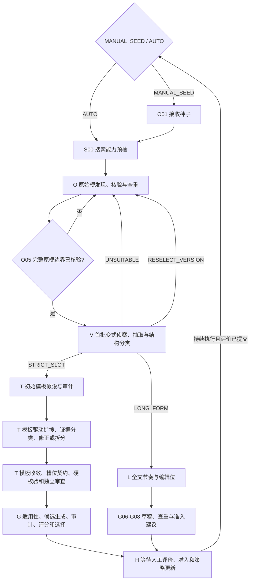

# 状态机工作流

## 主流程

AUTO 先确认完整原梗，再以首批真实变式作结构路由；MANUAL_SEED 使用显式模式，省略时保持 `STRICT_SLOT`。两者都不按字符数决定模式。



V01-V06 是 AUTO_ROUTE 的共用侦察段：V05 同时标注“严格槽位证据”与“宏观节奏证据”，V06 输出 `ROUTE_STRICT_SLOT / ROUTE_LONG_FORM / NEED_MORE_EVIDENCE / RESELECT_VERSION / UNSUITABLE`。前两者必须有相应正证据；`STRICT_SLOT` 失败本身不能推出 `LONG_FORM`。

`LONG_FORM`：`S00 → O01/O02-O06（核验完整原梗与查重）→ V01-V06（AUTO_ROUTE 时）→ L01（复核并冻结完整参照版本）→ L02（复用并补充长变式证据）→ L03（节奏骨架与编辑位）→ L04（多候选生成）→ L05（审核与选择）→ G06-G08 → H02-H05`。显式 `LONG_FORM` 的 MANUAL_SEED 可在 O05 后直接进入 L01。各 L 节点见 [长梗改编](long-form-adaptation.md)；T/G01-G05 输出 `NOT_REACHED: MODE_NOT_APPLICABLE`。L05 无合格候选则停止。

## 节点职责

| 节点 | 职责 | 关键输出 |
|---|---|---|
| S00 | 验证所选提供方真实搜索索引和来源正文能力；浏览器插件也必须实测 | READY / ENVIRONMENT_BLOCKED |
| O01/O02 | 把种子或已知文本作为搜索钩子，规划具体既有梗方向 | 钩子候选，不是已确认完整原梗 |
| O03 | 规划原梗核验/发现查询 | 具体查询、目的、排除项 |
| O04 | 执行搜索 | 原始响应、正文可用性、费用 |
| O05 | 只选一个最合适原梗并核验最小闭合传播边界 | `complete_reference`、版本差异、完整性状态 |
| O06 | 与正式梗标题查重，必要时取详情 | UNIQUE / SUSPECTED / DUPLICATE |
| V01 | 基于完整参照、不预设模板地规划首批变式查询 | 完整全文、相隔锚点、来源定向查询 |
| V02/V03 | 搜索并准备连续正文块 | 查询到正文的可追溯映射 |
| V04 | 从每个正文块抽取候选，可拆一页多条 | 原样引文及位置 |
| V05 | 分类首批真实改编证据 | 严格槽位、宏观节奏、转载/噪声及理由 |
| V06 | AUTO 按结构路由；显式 STRICT_SLOT 判断启动充分性 | 路由、补搜或放弃 |
| T01/T02 | 最小泛化地提出并审计初始模板 | 模板、固定片段、槽位、覆盖 |
| T03/T04 | 程序依据模板生成并执行扩搜 | 固定锚点与已观察值的组合查询 |
| T05-T08 | 抽取新证据并保持/修订/拆分模板 | 版本差异与证据映射 |
| T09 | 计算收敛 | CONTINUE / CONFIRMED / INSUFFICIENT |
| T10 | 生成槽位填充契约 | 词法句法类型、语义角色、绑定、约束 |
| T11/T12 | 程序硬校验与独立语言审查 | PASS 或原子问题清单 |
| T13 | 唯一一次完整包修订 | 字段级差异，之后重走 T11/T12 |
| G01 | 判断是否适合回填凿agu | 可映射槽位与风险 |
| G02/G03 | 生成并硬审计候选集 | 至少一条最小替换、全部可按模板重建 |
| G04/G05 | 独立评分并选择 | 分维度评分、淘汰理由、唯一选择 |
| G06-G08 | 形成草稿、标题查重、提出准入建议 | 草稿标题、文本、ADMIT/NOT_ADMIT 建议 |
| H02-H05 | 等待人工评价、处理准入、更新策略、结束 | 完整评价、策略差异、下一状态 |

## 流转不变量

- 只让搜索工具返回外部结果；主管决定搜什么和如何解释，程序保存证据、预算及状态。使用 Codex 浏览器时，搜索页和来源页分别映射为 `SEARCH_INDEX` 与 `SOURCE_FETCH` 调用。
- 每个节点都输出职责、输入摘要、判断、结果、证据、警告、下一步。
- 重试不覆盖旧记录；人工修正建立新分支。
- 搜索/模板证据耗尽可以放弃，不能用生成文本补证。
- O05 的 `complete_reference.completeness_status` 必须为 `VERIFIED`；钩子不能越级成为 V/T/L/G 的原梗输入。
- 所有路径若已形成最终候选，都要进入人工评价；重复只影响准入建议，不绕过评价。

以下是共享边界与 `STRICT_SLOT` 硬流转，不存在“为了展示后续能力而临时继续”的例外：

```text
任何真实搜索前 S00 != READY → ENVIRONMENT_BLOCKED
O05 completeness_status != VERIFIED → 补搜或换原梗，禁止 V01/L01
V06=ROUTE_STRICT_SLOT/BOOTSTRAP_SUFFICIENT → T01
V06=ROUTE_LONG_FORM → L01
V06=NEED_MORE_EVIDENCE → 继续 V；V06=UNSUITABLE → AUTO 换候选或停止
V06=RESELECT_VERSION → O05 更新版本选择并重跑 V01-V06，禁止就地切模式
T02 != PASS                  → 重试 T01 或停止，禁止 T03
T09 != CONFIRMED             → 继续 T03 或停止，禁止 T10
T11/T12 首次 FAIL            → T13 → T11/T12
T11/T12 修订后再次 FAIL      → H01，禁止 G01
G01 != SUITABLE              → 停止生成，禁止 G02
G03 != PASS                  → 修订候选或停止，禁止 G04
H02 人工评价未提交           → WAITING_HUMAN_EVALUATION
```

在固定输入测试中可以单独调用后置节点，但必须标记 `TEST_FIXTURE_MODE`；不得把这种局部测试描述成生产状态机已经从上游合法流转到该节点。用户只提供无来源文本且没有明确授权 fixture 分析时，它们仍是 `UNCERTAIN` 线索；S00 阻塞属于合法停止，不必为了到达 V/T 节点消耗虚构搜索。
